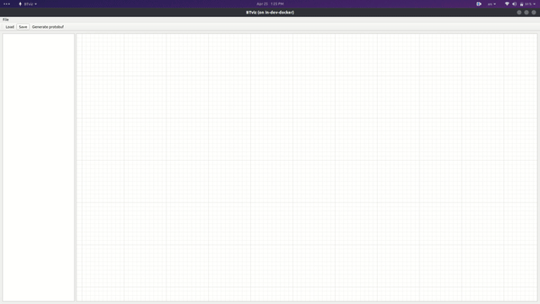

# Behaviour Planning

Custom Behaviour Planning module based on Hierarchical Behaviour Trees for Apollo 6.0

## Repo structure

```
BehaviourPlanning
│ 
├── apollo - Folder with the code
│    
├── docs - Documentation
│   ├── apollo_docs - Documentation related to the Apollo system
|   |   ├── apollo_with_inno_sim - How to run Apollo with the Innopolis Simulator
|   |   ├── map_module - Apollo Map module documentation
|   |   ├── planning_module - Apollo Planning module documentation
│   │   └── routing_module - Apollo Routing module documentation
│   └── behaviour_planning - Everything related to the Behaviour Planning approach
├── simulator - Folder for the simulator
```

## Things to check out

Here are some of the things that might be interesting:

### Behaviour Tree Planner implementation

The code is located in the `BehaviourPlanning/apollo/modules/planning_btree/` folder

### BTViz

The tool to visualize behaviour trees:



BTViz code is located in the `BehaviourPlanning/apollo/modules/tools/btviz/` folder

### Behaviour Tree Planner documentation

Documentation of the proposed behaviour tree planner implementation is in the `BehaviourPlanning/docs/behaviour_planning/README.md`

### Apollo modules documentation
Documentation of Apollo `map`, `routing` and `planning` modules in the `BehaviourPlanning/docs` folde

## Some terminology

- The self-driving car will be related to as: ADC (**A**utonomous **D**riving **V**ehicle), ego vehicle, the vehicle or the car (if it is clear from the context)

## Installation

Clone the repo into some folder: 

```
git clone https://github.com/Sarrasor/BehaviourPlanning.git
```

I will refer to this folder as `BehaviourPlanning` from now on

To prepare the environment, check out the `BehaviourPlanning/docs/apollo_with_inno_sim/README.md`