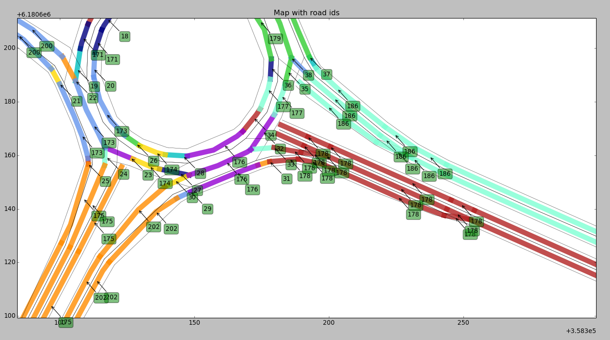
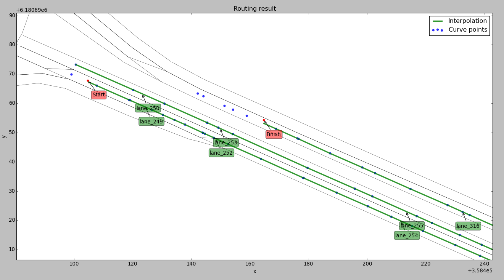
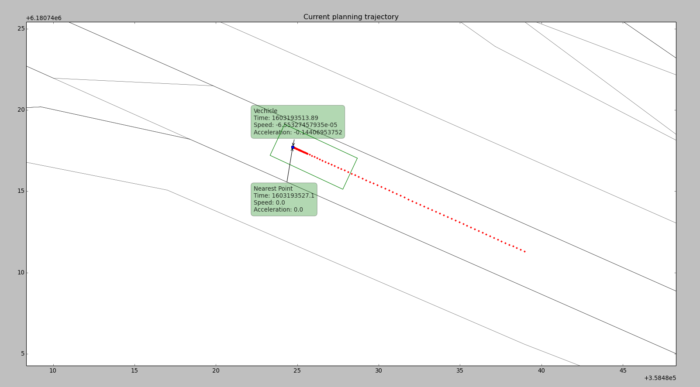
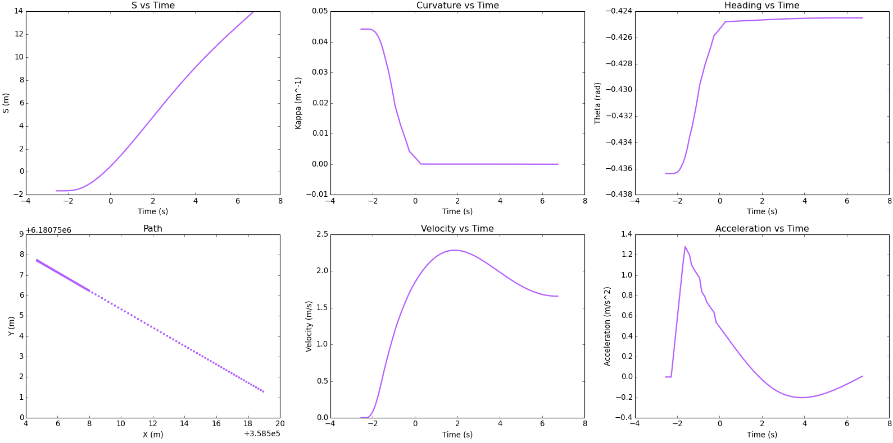

# Visualization tools

Here you can find several python visualization tools for modules.
Execute all the commands from the `visualization` directory.

## Routing

### Plot map



Plots an input map. If no map is provided, will plot default map from data directory.
Tags on the plot are road ids.

```
Usage: python -m routing/plot_map [-h] [--map_path MAP_PATH]

Optional arguments:
  -h, --help           Show this help message and exit
  --map_path MAP_PATH  The path to a map directory
```

### Plot route



Plots routing result. If no data is provided, will plot default scenario from data directory.
Tags on the plot are lane ids.

```
Usage: python -m routing/plot_route [-h] [--use_s] [--map_path MAP_PATH] [--routing ROUTING]

Optional arguments:
  -h, --help           Show this help message and exit
  --use_s              Whether to use s values from routing response
  --map_path MAP_PATH  The path to a map directory
  --routing ROUTING    The path to a routing response file
```


## Planning

### Plot planning trajectory on a map



Plots current ADCTrajectory planning result and the ego vehicle position on a map.
If no data is provided, will plot default scenario from data directory.


```
Usage: python -m planning/plot_trajectory [-h] [--map_path MAP_PATH]
                          [--localization_path LOCALIZATION_PATH]
                          [--planning_path PLANNING_PATH]

Optional arguments:
  -h, --help                             Show this help message and exit
  --map_path MAP_PATH                    The path to a map directory
  --localization_path LOCALIZATION_PATH  The path to a localization file
  --planning_path PLANNING_PATH          The path to a planning trajectory file
```

### Plot trajectory graphs



Plots current ADCTrajectory planning parameters. If no data is provided, will plot default scenario from data directory.

```
Usage: python -m planning/plot_graphs [-h] [--relative_time]
                      [--localization_path LOCALIZATION_PATH]
                      [--planning_path PLANNING_PATH]

Optional arguments:
  -h, --help                               Show this help message and exit
  --relative_time                          Whether to use relative time
  --localization_path LOCALIZATION_PATH    The path to a localization file
  --planning_path PLANNING_PATH            The path to a planning trajectory file

```
