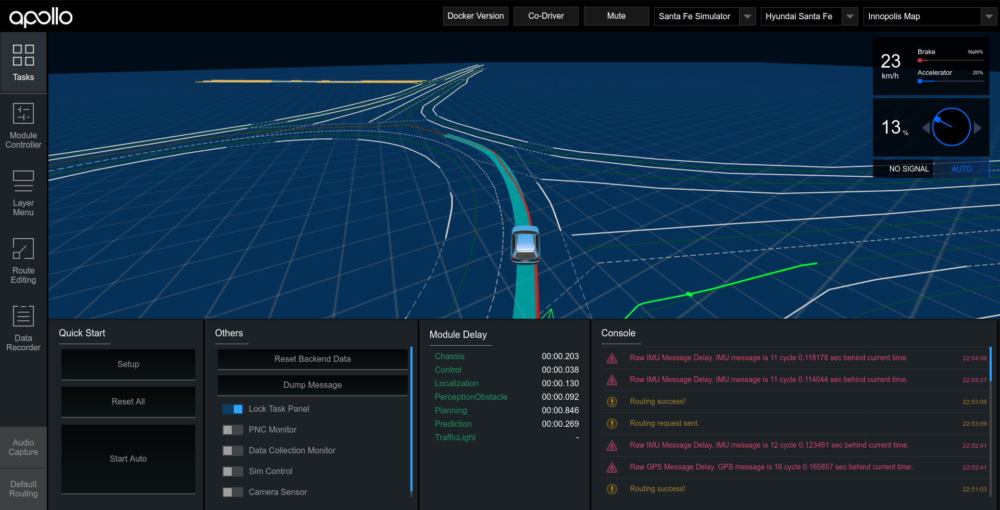
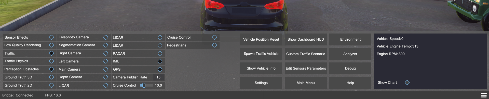
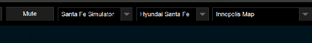
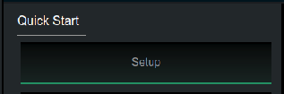
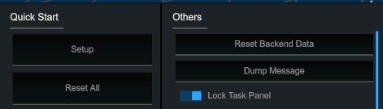
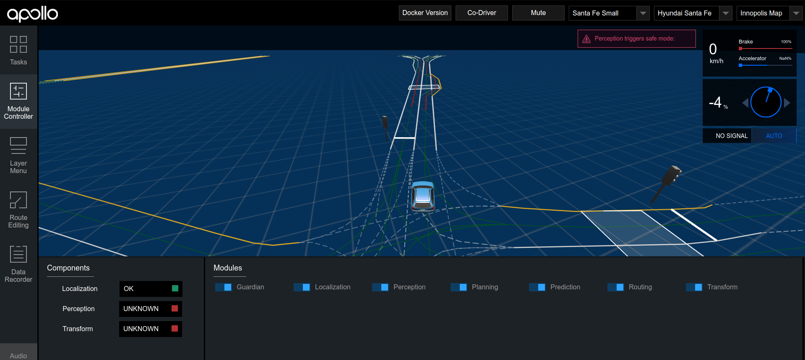
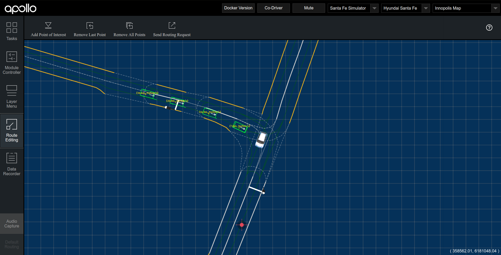

# Running Apollo with Innopolis Simulator

In this section we will see how to run the Apollo framework along with the Innopolis Simulator.

## Required modifications
In order to have Innopolis Simulator running with Apollo 5.0 you will have to do the following steps:

	1. Add Cyber Bridge
	2. Update map protobuf files
	3. Add a new vehicle to Dreamview
	4. Add a new setup mode to Dreamview

The required files are located in the `additional_files` folder.

## Installation steps
The steps described below were tested on Ubuntu 20.04 LTS

Download the Innopolis Simulator from [here](https://github.com/inno-robolab/InnoSimulator/releases). Extract it into the `simulator` folder or in any folder you prefer. We will refer to the folder to where you have extracted the simulator as the `simulator` folder.

Do not forget to make the simulator executable with `chmod +x InnoSimulator.x86_64`

Clone or download a zip archive with apollo repository from [here](https://github.com/ApolloAuto/apollo/tree/r5.0.0). The branch should be r5.0.0.

Extract it into the `apollo` folder or in any folder you prefer. Very important to extract it into the existing `apollo` folder if you want to run the Behaviour Tree code with Apollo. We will refer to the folder to where you have extracted the apollo code as the `apollo` folder.

Now you have to add some files and build the Apollo system:

### Adding cyber bridge
In order to connect Apollo with the simulator we will use the Cyber Bridge.

-  Add the `bridge` folder from `additional_files` into the `apollo/cyber/` folder
-  Add the `bridge.sh` file from `additional_files` into the `apollo/scripts/` folder
-  Make `bridge.sh` executable with `chmod +x apollo/scripts/bridge.sh`

### Adding map protobuf files
Innopolis maps are customized Apollo maps. So, we will have to update the map module protobufs in order to use Innopolis maps.

- Replace the `apollo/modules/map/proto` folder with the `proto` folder from `additional_files`
- Add the `innopolis_map` folder from `additional_files` into `apollo/modules/map/data/`

### Adding vehicle configuration
Apollo also needs to know the vehicle configuration.

- Add the `hyundai_santa_fe` folder from `additional_files` into the `apollo/modules/calibration/data/` folder
- Replace the `apollo/modules/common/configs/proto/vehicle_config.proto` file with the `vehicle_config.proto` file from `additional_files`

### Adding setup configuration
In order to be able to launch all required Apollo modules from Dreamview we should create a setup configuration file.

- Add the `santa_fe_simulator.pb.txt` file from `additional_files` into the `apollo/modules/dreamview/conf/hmi_modes/` folder. You can delete other .pb.txt files to make the list of configuration files in Dreamview smaller. We will not use them anyway

### Building the Apollo repository
Apollo uses Docker containers to make the usage easier. So, make sure you have installed Docker. If you need additional instructions on Docker installatioin, check out [this](https://github.com/ApolloAuto/apollo/blob/master/docs/specs/prerequisite_software_installation_guide.md) link.

- `cd` into the `apollo` folder from the terminal
-  Create Docker container with `bash docker/scripts/dev_start.sh`. It will pull the Apollo image and make some preparations. The process will take some time.
- Get inside the container with `bash docker/scripts/dev_into.sh`
- Build the apollo with `./apollo.sh clean && ./apollo.sh build_cpu`. You can use `./apollo.sh build_gpu` if you have GPU installed on your system.  Other build options are explained [here](https://github.com/ApolloAuto/apollo/blob/master/docs/specs/apollo_build_and_test_explained.md). Build will take a while (mine took ~1 hour on an i5  CPU). Time to grab some tea and relax.
-  Now it is time to build the Cyber Bridge. Run this command in the container: `./apollo.sh build_cyber && source /apollo/cyber/setup.bash`

## Launch steps
- `cd` into the `simulator` folder and launch the simulator with `./InnoSimulator.x86_64`

#### Simulator launch and setup
Run the scene with **Launch** button in the bottom right corner.

This should spawn the car and show you this configuration panel:

You will have to turn these modules on:
- **IMU**
- **GPS**
- **Perception obstacles**
- **Pedestrians or Traffic**. It seems there is a bug (or a feature) in the Perception obstacles module. It will not send any message to Apollo without any obstacle. Planning module will not execute since there is no information about obstacles. So, turn traffic or pedestrians on.

#### Apollo and Dreamview launch
- `cd` into the `apollo` folder and get inside the Docker container with `bash docker/scripts/dev_into.sh` 
-  From within the container run the system with `./scripts/bootstrap.sh start`. You can stop the system with `./scripts/bootstrap.sh stop`
- Within the container run the Cyber Bridge with `./scripts/bridge.sh`
- You can check if messages from InnopolisSimulator are coming with `cyber_monitor`
- Go to `http://localhost:8888/` to open Dreamview

#### Dreamview setup
On the Dreamview web page, in the top right corner select:
- **Santa Fe Simulator** setup mode
- **Hundai Santa Fe** vehicle
- **Innopolis Map** map

The result should look like this:

Now we can launch autonomous driving modules. Press the setup button. It will try to launch all modules that are defined in the setup configuration file. Here is how the button looks like:

 If it is not active, unlock it:
 

Check the situation on the **Module Controller** tab. Turn on grayed out module buttons if necessary. It should look like this:
 

Now you can send a target point to the vehicle. In order to do that, open **Route Editing** tab, create a target point by clicking on the desired location, and press **Send Routing Request** button.

Car should autonomously reach the target point. Cool, you can enjoy the simulator now!

## List of useful commands:
- `bash docker/scripts/dev_start.sh` - to create Docker container
- `bash docker/scripts/dev_into.sh` - to get into the Docker container
- `./scripts/bootstrap.sh [start or stop or restart]` - to start/stop/restart Dreamview
-  `bash ./docker/scripts/dev_start.sh stop` - to stop all Apollo Docker containers

Note, that Apollo 5 uses CyberRT, not ROS. So, you will have to use CyberRT. The good thing is, CyberRT tools are very much like ROS tools. 

- `cyber_monitor` - interactive topic monitoring
- `cyber_channel list` - to see all available topics. Like `rostopic list`
- `cyber_launch start path/to/launch/file.launch` - to launch your module. Like `roslaunch package_name file.launch`
- `mainboard -d path/to/dag/file.dag` - to launch dag file
 
## Some tips
- Apollo creates huge log files. If you see no free space on your hard drive, consider cleaning the `apollo/data/` folder.
-  Apollo uses the Bazel build system. So, if you see `BUILD` files - it is Bazel. You can get more information about it [here](https://www.bazel.build/).
- Apollo uses its own runtime framework CyberRT. Basically, it is customized ROS. Same concepts. You can check out [this](https://cyber-rt.readthedocs.io/en/latest/CyberRT_Python_API.html) link to get how to write Reader (Subscriber in ROS) and Writer (Publisher in ROS) in Python.
- If you modify config files - restart Apollo and Dreamview with `./scripts/bootstrap.sh stop && ./scripts/bootstrap.sh start`
- If you modify protobufs or source code - rebuild with `./apollo.sh build_cpu`. You can also rebuild particular modules with `bazel build //path/to/module:module`
