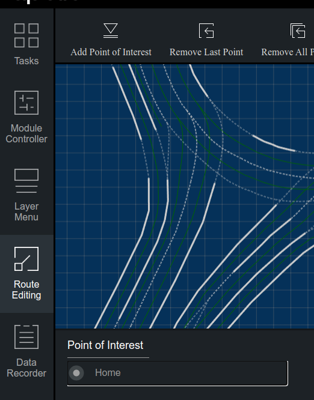
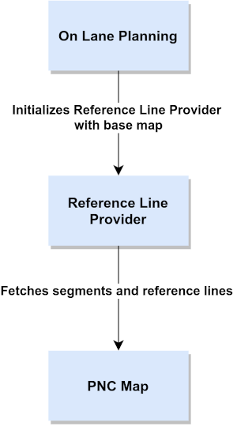
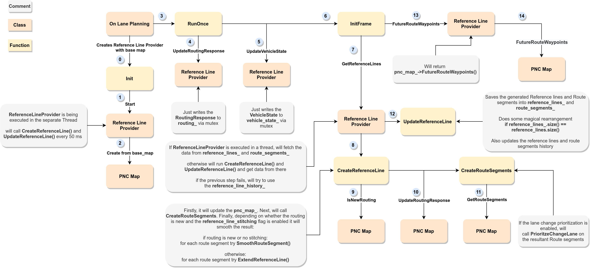

# Apollo Map module

The main task of the map module is to read a high-precision map from files and convert it into the map data structure for further use by planning module. The description of the data structure can be found into the `/apollo/modules/map/proto` folder

**The module does not create maps, it only reads them**

## Module folder structure

```
/apollo/modules/map/
├── data - Folder for maps
│   └── innopolis - Map of Innopolis
├── hdmap - HD map processing modules
│   ├── adapter - Module to read OpenDrive xml map
│   │   └── xml_parser
│   └── test-data
├── pnc_map - Map processing for the planning module
│   └── testdata
├── proto - Map elements message definition
├── relative_map - Relative map modules
│   ├── common
│   ├── conf
│   ├── dag
│   ├── launch
│   ├── proto
│   ├── testdata
│   │   └── multi_lane_map
│   └── tools
└── tools - Several useful tools to work with map files
    ├── bin_map_generator.cc - Converts base_map.txt to base_map.bin
    ├── map_datachecker -
    ├── map_tool.cc - Generates map with given x-y offset
    ├── map_xysl.cc - Several functions such as "GetElementByID" or "XY -> SL"
    ├── proto_map_generator.cc - Converts opendrive base_map.xml to protobuf base_map.txt and base_map.bin
    ├── quaternion_euler.cc - Tool to convert Quaternion to Euler angles
    ├── refresh_default_end_way_point.cc - Updates default end way point
    └── sim_map_generator.cc - Generates sim map
```

## Maps

Apollo uses modified OpenDrive format a. k. a. Apollo OpenDrive. Check out the **Links** section for more information on the (Apollo) OpenDrive format.


Every map is described by at least three files:

- **Base map** - is the most complete map that has all roads, lane geometry, and labels. The other maps are generated based on it
- **Routing map** - has the topology of lanes from the base map
- **Sim map** - a light version of the base map for Dreamview visualization. Has reduced data density for faster performance

There are tools to convert Base map to Routing or Sim map. Check out `/apollo/modules/map/data/README.md`

Map data structures are defined with protocol buffers. `map/proto` folder contains protobuf message definitions. You can find more information about the meaning of messages [here](https://github.com/daohu527/Dig-into-Apollo/tree/master/modules/map#%E5%9C%B0%E5%9B%BE%E4%BF%A1%E6%81%AF%E5%A4%B4)

In addition there is a PNC map:

- **PNC map** - Planning and Control map, created from the base map

### Maps meta info

You can add additional info to maps:

`metaInfo.json` - describes map offset to be applied

**This can influence the ability of finding the nearest lane for routing, use carefully**

Example:

```
{
    "offsets": 
    {
        "xoffset": 0.5,
        "yoffset": 0.2
    }
}
```

`default_end_way_point.txt` - describes default ending way point

Example:

```
landmark {
    name: "Home",
    waypoint {
        id: "Home"
        s: 153.0
        pose {
            x: 586367.706490
            y: 4140785.357946
        }
    }
}
```

This endpoint will appear in Dreamview on the `Route Editing -> Add Point of Interest` Tab:



## HD map class

Parses map and provides an API for other modules.

The parser is located in `hdmap/adapter`. The most interesting files are in `hdmap/adapter/xml_parser` and `hdmap/opendrive_adapter.cc`. 

The API is defined in `hdmap/hdmap_impl.cc`. It consists of basic functions like `GetLanes()` and `GetCrosswalks()`

## PNC Map

Planning and Control Map



Module that is being called by `reference_line_provider.cc` when the `Frame` data structure gets updated (it is updated on each iteration of planning cycle in `on_lane_planning.cc`). Extracts reference lanes and segments for the planning module.

The planning module then shrinks reference lines and segments with look forward/backward distances, and initializes current frame with them + future route waypoints

Usage pipeline:

- Set current routing response with `UpdateRoutingResponse(routing_response)`
- Get current route segments in range `[backward_length, forward_length]` with `GetRouteSegments(vehicle_state, backward_length, forward_length, *route_segments)`. You can also call `GetRouteSegments(vehicle_state, *route_segments)`. In this case `backward_length` and `forward_length` will be defined from adc's velocity and config files

Contains:

- `routing` - routing response
- `route_indices` - vector of structs that contain lane segment along with array of three indices `{road_index, passage_index, lane_index}` 
- `range_start` -
- `range_end` -
- `range_lane_ids` - routing ids in range?
- `all_lane_ids` - all lane ids for current routing?
- `routing_waypoint_index` - vector of pairs `index->Waypoint`
- `next_routing_waypoint_index` - index of next waypoint in `routing_waypoint_index`
- `hdmap` - pointer to the HD map
- `is_same_routing` - flag for the result of comparison of new and current routing responses
- `adc_state` - vehicle state
- `adc_route_index` - index of adc's location in `route_indices`
- `adc_waypoint` - adc's current waypoint?
- `stop_for_destination` - flag to help solve problems with looped routing (when we need to pass destination multiple times, but stop only on the last passage)

### PNC Map Path

Contains several helper classes:

#### Map Path Point

### PNC Map Route Segments

Represent passages from routing response + adds some additional info. So, we will use `route segment` and `passage` interchangeably in this context. Route Segments class inherits from `std::vector<LaneSegments>`

Some interface usages:

- `Stitch(route_segment)` - stitches current route segment with `route_segment`
- `Shrink()` - shrinks current route segment based on `look_forward` and `look_backward` distances
- `FirstWaypoint()` - get the first waypoint from the lane segments
- `LastWaypoint()` - get the last waypoint from the lane segments
- `NextAction()` - get the next action to perform
- `PreviousAction()` - get the action that led to this route segment
- `CanExit()` - check if the adc can move from this route segment to any other route segment

Contains:

- `route_end_waypoint` - the end point of the original passage in routing. Used to check if the adc is out of current routing
- `can_exit` - whether this route segment can lead to another route segment in routing response
- `is_on_segment` - flag that shows whether the adc is on this route segment
- `is_neighbor` - shows whether this route segment is a neighbor to the adc's current route segment
- `next_action` -  next action adc should perform if the adc is on this route segment. One of: `FORWARD`, `LEFT`, `RIGHT`
- `previous_action` - previous action adc had performed to reach this route segment. One of: `FORWARD`, `LEFT`, `RIGHT`
- `id` - id of the route segment?
- `stop_for_destination` - whether the adc should stop for the destination 

### PNC Map and Reference Line Provider

PNC Map is contained in the Reference Line Provider. Here is the scheme of the Reference Line Provider invocation:



## Relative map

## Links

- [HD maps review](https://auro.ai/blog/2020/03/using-open-source-frameworks-in-autonomous-vehicle-development-part-2/)

- [OpenDrive specification](https://www.asam.net/standards/detail/opendrive/)

- [Review of Apollo OpenDrive](http://road2ai.info/2018/08/11/Apollo_02/)

- [Intro to Apollo OpenDrive](https://blog.yongcong.wang/2019/10/14/autonomous/Introduce-to-Autodrive-HD-Map-Format-OpenDRIVE-and-Apollo-OpenDRIVE/)

- [Dig into Apollo Map Module](https://github.com/daohu527/Dig-into-Apollo/tree/master/modules/map)

- [Planning and Control(PnC) map tutorial](https://github.com/YannZyl/Apollo-Note/blob/master/docs/planning/pnc_map.md)