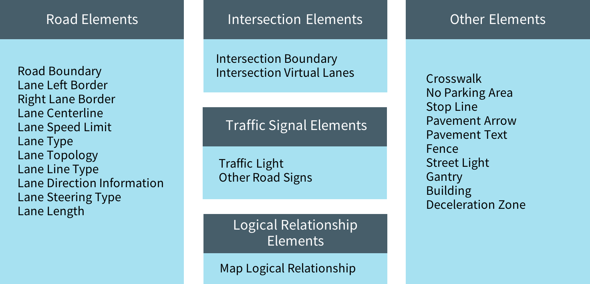
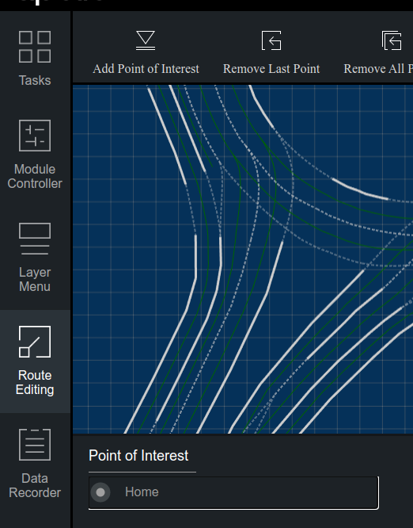
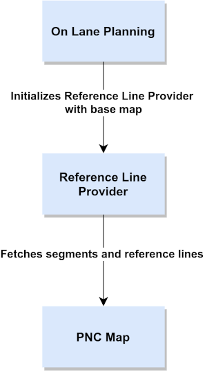

# Map module

The main task of the map module is to read a high-precision map from files and convert it into the map data structure for further use by planning module. The description of the data structure can be found into the `/apollo/modules/map/proto` folder

**The module does not create maps, it only reads them**

## Module folder structure

```
/apollo/modules/map/
│ 
├── data - Folder for maps
│   └── innopolis - Map of Innopolis
├── hdmap - HD map processing modules
│   ├── adapter - Module to read OpenDrive xml map
│   │   └── xml_parser
│   └── test-data
├── pnc_map - Map processing for the planning module
│   └── testdata
├── proto - Map elements message definition
├── relative_map - Relative map modules
│   ├── common
│   ├── conf
│   ├── dag
│   ├── launch
│   ├── proto
│   ├── testdata
│   │   └── multi_lane_map
│   └── tools
└── tools - Several useful tools to work with map files
```

## Folder descriptions

### `data`

Contains maps to use

Apollo uses modified OpenDrive format a. k. a. Apollo OpenDrive. Checkout **Links** section for more information on the (Apollo) OpenDrive format.



Every map is described by at least three files:

- **Base map** - is the most complete map that has all roads, lane geometry, and labels. The other maps are generated based on it
- **Routing map** - has the topology of lanes from the base map
- **Sim map** - a light version of the base map for Dreamview visualization. Has reduced data density for faster performance

There are tools to convert Base map to Routing or Sim map. Check out `/apollo/modules/map/data/README.md`

#### Additional files

You can add additional files:

`metaInfo.json` - describes map offset to be applied

**This can influence the ability of finding the nearest lane for routing, use carefully**

Example:

```
{
    "offsets": 
    {
        "xoffset": 0.5,
        "yoffset": 0.2
    }
}
```

`default_end_way_point.txt` - describes default ending way point

Example:

```
landmark {
    name: "Home",
    waypoint {
        id: "Home"
        s: 153.0
        pose {
            x: 586367.706490
            y: 4140785.357946
        }
    }
}
```

This endpoint will appear in Deamview on the `Route Editing -> Add Point of Interest` Tab:



_ _ _ _ _


### `hdmap`

Parses map and provides an API for other modules.

The parser is located in `hdmap/adapter`. The most interesting files are in `hdmap/adapter/xml_parser` and `hdmap/opendrive_adapter.cc`. 

The API is defined in `hdmap/hdmap_impl.cc`. It consists of basic functions like `GetLanes()` and `GetCrosswalks()`


_ _ _ _ _


### `pnc_map`



Module that is being called by `reference_line_provider.cc` when the `Frame` data structure gets updated (it is updated on each iteration of planning cycle in `on_lane_planning.cc`). Extracts reference lanes and segments for the planning module.

The planning module then shrinks reference lines and segments with look forward/backward distances, and initializes current frame with them + future route waypoints


_ _ _ _ _


### `proto`

Contains protobuf message defintions. You can find more information about the meaning of messages [here](https://github.com/daohu527/Dig-into-Apollo/tree/master/modules/map#%E5%9C%B0%E5%9B%BE%E4%BF%A1%E6%81%AF%E5%A4%B4)

_ _ _ _ _


### `tools`

Tools for map editing

```
/apollo/modules/map/tools
│ 
├── bin_map_generator.cc - Converts base_map.txt to base_map.bin
├── map_datachecker - 
├── map_tool.cc - Generates map with given x-y offset
├── map_xysl.cc - Several functions such as "GetElementByID" or "XY -> SL"
├── proto_map_generator.cc - Converts opendrive base_map.xml to protobuf base_map.txt and base_map.bin
├── quaternion_euler.cc - Tool to convert Quaternion to Euler angles
├── refresh_default_end_way_point.cc - Updates default end way point
└── sim_map_generator.cc - Generates sim map
```

## Links

- [HD maps review](https://auro.ai/blog/2020/03/using-open-source-frameworks-in-autonomous-vehicle-development-part-2/)

- [OpenDrive specification](https://www.asam.net/standards/detail/opendrive/)

- [Review of Apollo OpenDrive](http://road2ai.info/2018/08/11/Apollo_02/)

- [Intro to Apollo OpenDrive](https://blog.yongcong.wang/2019/10/14/autonomous/Introduce-to-Autodrive-HD-Map-Format-OpenDRIVE-and-Apollo-OpenDRIVE/)

- [Dig into Apollo Map Module](https://github.com/daohu527/Dig-into-Apollo/tree/master/modules/map)

- [Apollo Routing Module](https://paul.pub/apollo-routing/)

- [Planning and Control(PnC) map tutorial](https://github.com/YannZyl/Apollo-Note/blob/master/docs/planning/pnc_map.md)