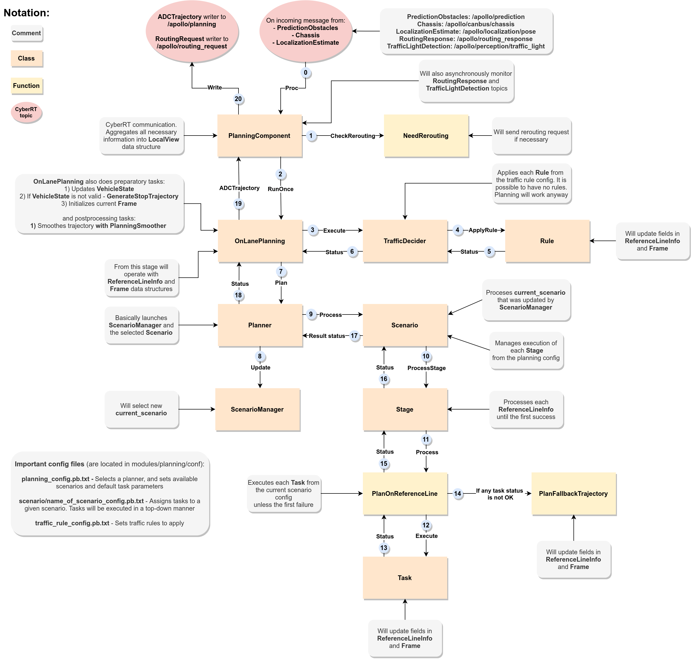

# Apollo Planning Module

Planning Module is responsible for the behaviour planning and trajectory generation

## Module overview

## Planning Component

The main purpose of the component is to serve as the adapter between the planning module and other modules

It connects to CyberRT to listen for incoming messages and write the resultant trajectory

Pipeline:

- Init
  - Create dependency injector
  - Instantiate and initialize current planning base
  - Load planning config
  - Configure message_process instance if offline learning is enabled
  - Create readers and writers
- Proc
  - Check rerouting (check if rerouting flag in the planning context is set) and send rerouting request if necessary
  - Fill local view with incoming data
  - Check input data in the local view
  - Handle learning data
  - Run planning base
  - Fill the result message and send it
  - Save the result to history

Contains:

- `traffic_light_reader` - traffic light detection messages reader
- `routing_reader` - routing response message reader
- `pad_msg_reader` - ?
- `relative_map_reader` - relative map message reader
- `story_telling_reader` - stories reader
- `planning_writer` - planning result trajectory writer
- `rerouting_writer` - rerouting request writer
- `planning_learning_data_writer` - dataset writer for the learning module 
- `traffic_light` - traffic light detections
- `routing` - routing response to plan on
- `pad_msg` - ?
- `relative_map` - relative map for navi planning
- `stories` - stories from the storytelling module
- `local_view` - local view data to store CyberRT messages
- `planning_base` - instance of planning base. On lane or navi planning. Will be described below
- `injector` - dependency injector. Will be described below
- `config` - planning config
- `message_process` - learning data manager

## Planning base (On-lane planning case)

Here we consider the planning base class, the On-lane plannig base in particular

Pipeline of the On-lane planning:

- Init
  - CheckPlanningConfig
  - Init planning dispatcher
  - Load traffic rules
  - Reset local view
  - Initialize HD map
  - Initialize reference line provider
  - Dispatch and initialize current planner
  - If in learning mode, instantiate birdview feature renderer
- RunOnce
  - Remember planning cycle start time
  - Update vehicle state and align timestamp (if failed, generate stop trajectory)
  - Update reference line provider with new routing (if failed, generate stop trajectory)
  - Update reference line provider with new vehicle state
  - Compute stitching trajectory
  - Update ego state with stitching trajectory and vehicle state (if failed, generate stop trajectory)
  - Initialize current frame and add obstacles to reference lines to create reference line info
  - Apply traffic rules to reference lines 
  - Execute Plan function
  - Fill the result trajectory message
  - Add current frame to frame history
- Plan
  - Run planner 
  - If was using open space planner, process related results
  - Else, extract the best reference line and related info, then fill the result trajectory message
  - Update last publishable trajectory with current trajectory

Contains:

- `local_view` - local view. Will be described below
- `hdmap` - pointer to the HD map. Will be described below
- `start_time` - time of the start of a planning cycle
- `seq_num` - current sequence number. Used as index in history
- `config` - planning config
- `traffic_rule_configs` - config for traffic rules sub-module
- `frame` - frame with planning data. Will be discussed below
- `planner` - planner instance. Will be discussed below
- `last_publishable_trajectory` 
- `planner_dispatcher` - creates the current planner instance
- `injector` - dependency injector, created from the injector from the planning componet

On-lane planning has in addition:

- `last_routing` - 
- `reference_line_provider`
- `planning_smoother` - 

## Planner (Public road case)

Here we consider planner class, the public road planner in particular

Pipeline:

- Init
  - Initialize scenario manager
- Plan
  - Update the scenario manager with current point and frame
  - Get current scenario from the manager
  - Execute current scenario
  - If the scenario is done, update the manager

Contains: 

- `config` - planning config
- `scenario_manager` - scenario manager. Will be discussed below
- `scenario` - current scenario

## Scenario manager

Responsible for the current scenario selection

Pipeline:

- Init
  - Save planning config
  - Register scenarios (creates map of scenario configs)
  - Set default scenario type as `LANE_FOLLOW`
  - Create default scenario
- Update
  - Observe function call
  - ScenarioDispatch function call
- Observe
  - Clear `first_encountered_overlap_map`
  - Get first reference line info
  - Extract first encountered overlaps from the reference line
  - For each overlap, add current overlap if it is of type: `PNC_JUNCTION` or `SIGNAL` or `STOP_SIGN` or `YIELD_SIGN`
- ScenarioDispatch
  - If learning mode is active, update learning data and call ScenarioDispatchLearning function (it will return `LEARNING_MODEL_SAMPLE` scenario)
  - Else, call ScenarioDispatchNonLearning function
  - UpdatePlanningContext function call
  - If the current scenario is not the selected one, create current scenario
- ScenarioDispatchNonLearning
  - Will go through scenario select functions. Every select function will return its scenario type on success, and default scenario on failure. If current select function has returned its scenario, other select functions won't be invoked. The interesting thing is the order of invocation: "What dictates this order of invocaton?" 
- UpdatePlanningContext
 - Will call several methods that will update Planning context data. Contents of the planning context are described below

Contains:

- `injector` - dependency injector from the planning base
- `planning_config` - planning config
- `config_map` - map: scenario type -> scenario config
- `current_scenario` - current scenario
- `default_scenario_type` - initial scenario
- `scenario_context` - current scenario data. Now is empty struct
- `first_encountered_overlap_map` -map: overlap type -> path overlap 

## Dependency Injector

Implementation of the Dependency Injection Design Pattern

Was introduced in the Apollo 6

The purpose is to pass dependencies to other modules like `planning_base` or `planner` while controling the creation of dependency objects

Contains:

- `planning_context` - state of the planning
- `frame_history` - indexed queue(`seq_num` -> `Frame`) of max size `FLAGS_max_frame_history_num`
- `history` - history of planned trajectories, decisions on obstacles (decision is defined in `decision.proto`)
- `ego_info` - start point, vehicle state, front clear distance, ego vehicle config, and ego bounidng box
- `vehicle_state` - vehicle state provider
- `learning_based_data` - future trajectory from the learning module

## HD map

Check out the documentation for the mapping module [here](https://github.com/Sarrasor/BehaviourPlanning/tree/main/docs/apollo_docs/map_module)

## Frame

The data container that is used throughout every planning cycle

Contains:

- `pad_msg_driving_action` - enum of `NONE`, `FOLLOW`, `CHANGE_LEFT`, `CHANGE_RIGHT`, `PULL_OVER`, `STOP`, `RESUME_CRUISE`
- `sequence_num` - sequence number of a frame. initialized on frame creation
- `local_view` - data from other apollo modules
- `hdmap` - hdmap pointer. Can be used to gather info from the HD map
- `planning_start_point` - initialized on frame creation
- `vehicle state` - protobuf message with the state of the ADC
- `reference_line_info` - list of reference lines
- `is_near_destination` - will be set true if any segment from CreateReferenceLineInfo has stop for destination
- `drive_reference_line_info` - resultant reference line to drive on
- `obstacles` - list of all obstacles 
- `traffic_lights` - map of traffic light detection protobuf messages
- `current_frame_planned_trajectory` - current frame trajectory to pass to the control module
- `current_frame_planned_path` - current frame path for possible future speed fallback
- `reference_line_provider` - generator of reference lines to plan on. NOT USED
- `open_space_info` - data for the open space planner
- `future_route_waypoints` - waypoints to pass through
- `monitor_logger_buffer` - logging buffer for the monitor module

Frame can also request rerouting by calling `Rerouting(PlanningContext)` and filling the rerouting field in the planning context. Frame does not contain the planning context within itself

## Local View

Contains messages from planning-related topics:

- `prediction_obstacles`
- `chassis`
- `localization_estimate`
- `traffic_light`
- `routing`
- `relative_map`
- `pad_msg`
- `stories`

## Planning context

Contains `planning_status` protobuf. Claimed to be persistent across multiple frames

### Planning status

Protobuf that contains:

- `BareIntersectionStatus` - current pnc junction overlap id, zero or more previous pnc junction overlap ids, and clear counter
- `ChangeLaneStatus` - current status (IN_CHANGE_LANE, CHANGE_LANE_FAILED, CHANGE_LANE_FINISHED) and id of the current route segment, timestamp of setting the current state, lane change starting position, timestamp of the last successful lane change planning, state of success of current path and speed profile generation, and flag if it is clear to change the lane
- `CreepDeciderStatus` - creep clear counter
- `CrosswalkStatus` - crosswalk id, zero or more timestamps of when to start stopping for the crosswalk + id of the corresponding obstacle, and zero or more finished crosswalks
- `DestinationStatus` - flag whether an ADC has passed the destination
- `EmergencyStopStatus` - coordinates of the stop fence location
- `OpenSpaceStatus` - flag position init and index history of partitioned trajectories
- `ParkAndGoStatus` - the initial position and heading of an ADC, status flag of in check stage, and ADC adjust end pose 
- `PathDeciderStatus` - number of frontal static obstacles and id of frontal static obstacle (probably current active), status flag of lane borrow scenario and decided side-pass direction (can be multiple) + counter of "able to use self lane" 
- `PullOverStatus` - pull-over type (usual or emergency), bool flag to ask to plan pull-over path, and other parameters like: position, theta, length and witdth
- `ReroutingStatus` - last rerouting time and routing request + bool flag to ask for rerouting
- `ScenarioStatus` - scenario type and stage type (probably current active)
- `SpeedDeciderStatus` - zero or more pedestrian stop times
- `StopSignStatus` - current and previous overlap ids with stop sign + ids of the obstacles to wait for
- `TrafficLightStatus` - current and previous overlap ids (zero or more of each type) with traffic light
- `YieldSignStatus` - current and previous overlap ids (zero of more of each type) with yield sign + ids of the obstacles to yield to

## Reference Line

Provides the interface of interaction with data the from PNC map

Use-cases:

- Cartesian <-> Frenet transformations
- Check whether given point (XY or Frenet), bounding box, SL-boundary are within the reference line
- Extract information about the reference line: road width, lane width, driving witdth, offset to map, road type, length, priority, speed limits

Contains:

- `speed_limit` - vector of speed limits in format (`start_s`, `end_s`, `speed_limit`). Overwrite speed limits from the HD map
- `reference_points` - reference points. Described below
- `map_path` - map path. Described below
- `priority` - some kind of priority 

Interesting methods:

- `Stitch(ReferenceLine)` - tries to stitch current reference line with the argument reference line. The stitching strategy is to use current reference points as much as possible
- `Segment(point, forward, backward)` - updates map_path to be [forward; backward] around the point
- `HasOverlap(Box2d)` - 
- `IsOnLane()` - checks if given argument(point, box, sl-boundary) is along the reference line
- `IsOnRoad()` - checks if given argument(point, box, sl-boundary) is along the reference line, excluding sideways and medians
- `IsBlockRoad(Box2d, gap)` - check if a box is blocking the road such that the remaining space gap is less than the gap
- `GetReferencePoint(s)` - extracts interpolated point from the `map_path` points based on the `s` argument
- `GetSpeedLimitFromS(s)` - first searches `speed_limit`, then sets speed_limit to min of `upper_planning_speed_limit` and HD map lane speed limit. If there was no HD map lane speed limit, will set `default_city_road_speed_limit` or `defaul_highway_speed_limit`

### Reference point

Helper class, extenson of the MapPathPoint (from PNC map `path.h` file) class with curvature and derivative of curvature

## Reference Line Provider

The main purpose of the reference line provider is to produce reference lines based on the PNC map, routing response, and the current position 

The public interface interaction pipeline is as follows:

- Create the reference line provider instance
- Use `Start()` and `Stop()` methods if you want to use threaded mode
- Use `UpdateRoutingResponse(routing)` and `UpdateVehicleState(vehicle_state)` to update the state of the provider
- Use `GetReferenceLines(reference_lines, segments)` to request current reference lines and segments based on the updated state
- Also, can use `FutureRouteWaypoints()` to request future waypoints from the routing request

Reference line sub-module has three smoothers. The default smoother in Apollo 6 is QP smoother

Contains:

- `smoother` - smoother to use
- `smoother_config` - configuration of the smoother
- `pnc_map` - pnc map. Described [here](https://github.com/Sarrasor/BehaviourPlanning/tree/main/docs/apollo_docs/map_module)
- `relative_map` - relative map. Described [here](https://github.com/Sarrasor/BehaviourPlanning/tree/main/docs/apollo_docs/map_module)
- `vehicle_state` - current vehicle state 
- `vehicle_state_provider` - used only when creating reference lines from the relative map
- `routing` - current routing request
- `reference_lines` - list of reference lines
- `route_segments` - list of route segments

## Reference Line Info

Wraps static reference line with dynamic info about obstacles and obstacle decisions, destination information, planning cost and priority cost etc

Contains:

- `junction_right_of_way_map`
- `vehicle_state`
- `adc_planning_point`
- `reference_line` - reference line which is being wrapped
- `cost` - "goodness" of the reference line. The lower - the better
- `is_drivable` - flag to mark line as drivable
- `path_decision`
- `blocking_obstacle`
- `candidate_path_boundaries`
- `candidate_path_data`
- `path_data`
- `fallback_path_data`
- `speed_data`
- `discretized_trajectory`
- `rss_info`
- `adc_sl_boundary` - sl boundary of the stitching point (starting point of the current trajectory) in the reference line frame
- `debug` - some debugging messages
- `latency_stats`
- `lanes` - route segments
- `is_on_reference_line`
- `is_path_lane_borrow`
- `status` - right of way status
- `offset_to_other_reference_line`
- `priority_cost`
- `planning_target`
- `trajectory_type`
- `first_encounter_overlaps` - nearest overlaps along the reference line in front of the ADC
- `st_graph_data` - data generated by speed bounds decider for st graph optimizers
- `vehicle_signal` - signals like horn, emergency lights, turn lights etc
- `cruise_speed` - speed to keep while cruising
- `path_reusable` 

### Map path

Defined in the PNC map sub-module. More about this module [here](https://github.com/Sarrasor/BehaviourPlanning/tree/main/docs/apollo_docs/map_module)

## Ego Info

## Trajectory stitcher

## Obstacles

Planning obstacles are created from Perception obstacles protobuf

## Traffic rules

## Storytelling

## Pad messages

## Planning smoother