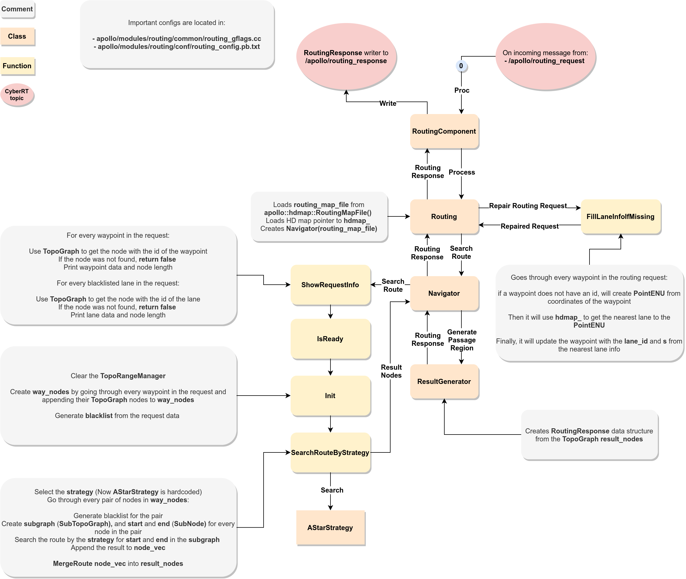
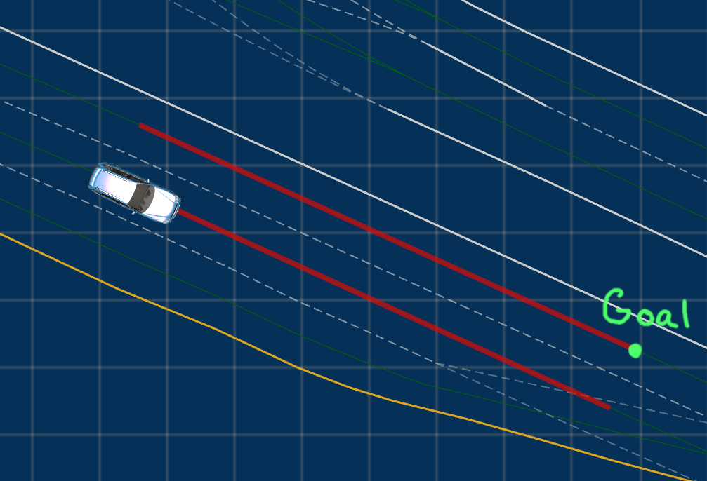
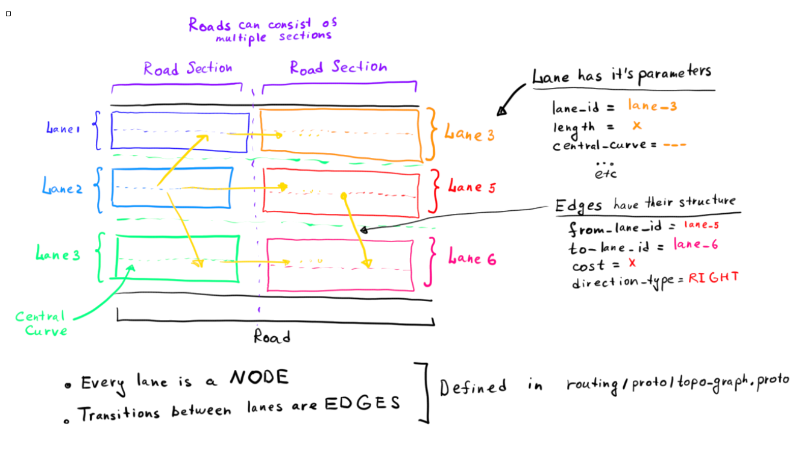
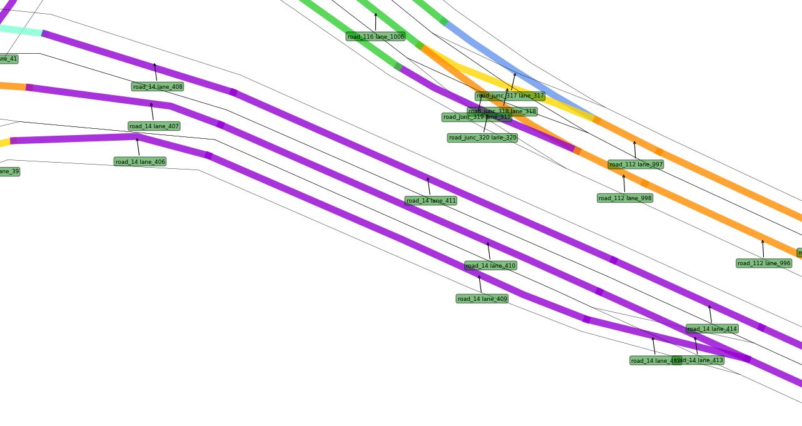
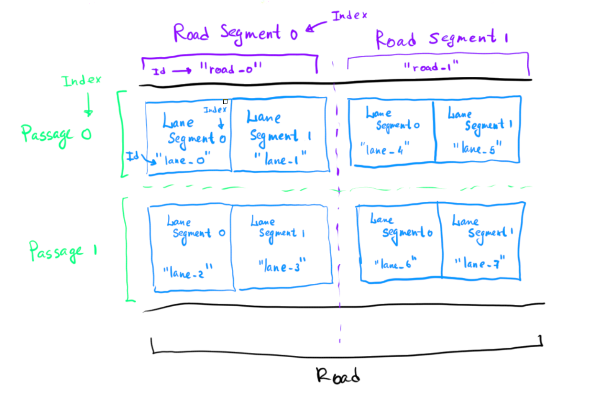
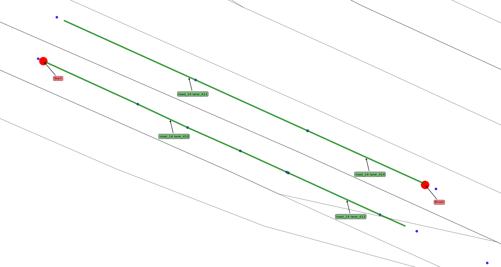

# Apollo Routing Module

The routing module uses routing map and routing requests to create routing responses that will be used in the Planning module

## Module folder structure

```
/apollo/modules/routing/
│
├── common - flag configuration files
├── conf - protobuf configuration files
├── core - main routing logic implementation
├── dag - dag file for the CyberRT Routing Component
├── graph - routing graph classes definitions
├── launch - Routing Component launch file
├── proto - Routing protobuf data structures definitions
├── strategy - Strategies for the Navigator. (It uses the Strategy Design Pattern)
├── tools - Some helper utilities
  ├── routing_cast.cc - Send routing response from a file to CyberRT every second
  ├── routing_dump.cc - Save routing response to a file
  └── routing_tester.cc - Send routing request request from a file to CyberRT every second
└── topo_creator - `base_map` to `routing_map` converter implementation
```

## Module overview



## Routing example



Imagine we want to go from the current location (depicted with the car), to the goal location (depicted with green point). First of all, we need to formulate our wish as a Routing request:

### Routing request

Routing request is usually generated in Dreamview and, in our example, has the following data:

```
header
{
  timestamp_sec: 1617434315.9109728
  module_name: "dreamview"
  sequence_num: 20
}

<!-- Starting location -->
waypoint
{
  id: "lane_410"
  s: 21.692566022640214
  pose
  {
    x: 358519.69714355469
    y: 6180750.5960693359
  }
}

<!-- Desired location -->
waypoint
{
  id: "lane_414"
  s: 9.75728550816529
  pose
  {
    x: 358548.46653527877
    y: 6180741.2346008308
  }
}
```

The request can contain multiple waypoints, which will mean that we want to go from the current location to the last waypoint with intermediate stops

In addition, you can specify the so-called `blacklist` of roads and lanes you want routing to avoid when planning.

More about the structure of the Routing request you can find in `routing/proto/routing.proto`

### Generating the route

Ok, now the Routing module knows what we want. It will use our Routing Request along with the routing map to generate the Routing response.

#### Routing map creation

In order to perform routing, we need to have the `routing_map`. Apollo creates it from the HD map called `base_map`. The code for the `routing_map` generation can be found in the `routing/topo_creator` folder

In Apollo routing map topology lanes represent nodes and relations between lanes are described by edges

Here is the picture that describes the situation:



Basically, Apollo takes the `base_map` and converts it into the graph representation to do the routing procedure.

There are some picularities like the difference between `TopoGraph` and `SubTopoGraph`. We will not go into such deep details because they are irrelevant to behaviour planning.

So, let us see how the map looks for our example:



It is the part of the `base_map` in our location. As we can see on the picture, there are lanes with different ids that are united by roads. In our case, we are interested in the road with id `road_14`.

#### Route search

Now the Routing module knows the graph representation of the map and knows our wishes, so it is time to perform actuall routing.

In general, we can add our routing strategies since the module uses the Strategy Design Pattern. Currently the routing module uses A* to find the route.

A* returns the search result in form of the graph, and we will need to convert it into another representation called Routing response. `ResultGenerator` class is responsible for that.

### Routing response

The structure of the Routing response is defined in the `routing/proto/routing.proto`, you can check it out. Now let us see what it it means:



- `Road` - full route from the current location to the goal. Consists of one or more Road Segments
- `RoadSegment` - part of the road. Has an id and consists of one or more passages. In the `routing.proto` Road Segments are named as `repeated road`, that can be confusing, bear that in mind when reading `pb.txt` of the Routing Response
- `Passage` - one or more consequent lane segments. Passages within the same Road Segment are parallel
- `LaneSegment` - basic building block of the Routing Response. Has an id and frenet `s` boundary

The indices on the picture denote the indices of corresponding elements in the `RoutingResponse` data structure. We will need this indices later, when we will move to the Planning Module and `PNC Map` in particular.

Here is how the Routing response will look like in our case:



Remember the Dreamview image from the above? Red lines on it exactly repeat this picture, which is what we expected.

The thing we did not expect, is the exact pattern of those lines. Please, refer to [this](https://github.com/ApolloAuto/apollo/issues/13308) issue on Apollo GitHub to get the context. This problem is the main problem that causes problems with planning later on.

And here is the protobuf representation of the routing response for our example:

```
header
{
  timestamp_sec: 1617434315.9354579
  module_name: "routing"
  sequence_num: 20
}

<!-- We have only one road segment in our case -->
road
{
  id: "road_14"
  passage
  {
    segment
    {
      id: "lane_410"
      start_s: 21.692566022640214
      end_s: 41.997633175161575
    }

    segment
    {
      id: "lane_413"
      start_s: 0
      end_s: 9.7573205153276135
    }
    can_exit: false
    change_lane_type: LEFT
  }

  passage
  {
    segment
    {
      id: "lane_411"
      start_s: 21.783945648491148
      end_s: 42.174547607606577
    }

    segment
    {
      id: "lane_414"
      start_s: 0
      end_s: 9.75728550816529
    }

    can_exit: true
    change_lane_type: FORWARD
  }
}

measurement
{
  distance: 30.062352660686649
}

routing_request
{
  header
  {
    timestamp_sec: 1617434315.9109728
    module_name: "dreamview"
    sequence_num: 20
  }

  waypoint
  {
    id: "lane_410"
    s: 21.692566022640214
    pose
    {
      x: 358519.69714355469
      y: 6180750.5960693359
    }
  }

  waypoint
  {
    id: "lane_414"
    s: 9.75728550816529
    pose
    {
      x: 358548.46653527877
      y: 6180741.2346008308
    }
  }
}

map_version: "gejson2proto_3.0"
status
{
  error_code: OK
  msg: "Success!"
}
```

## Links

- [Routing module review](https://github.com/daohu527/dig-into-apollo/tree/master/modules/routing)
- [Another Routing module review](https://paul.pub/apollo-routing/)
- [Multiple reference lane generation issue](https://github.com/ApolloAuto/apollo/issues/13308)