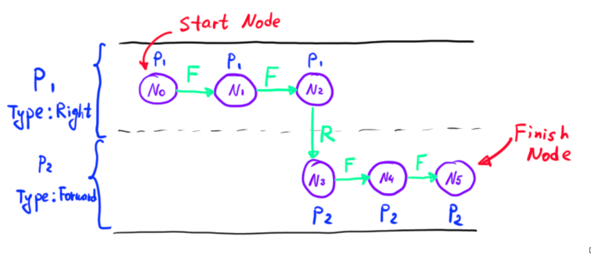

# Apollo Routing Module

The routing module uses routing map and routing requests to create routing responses that will be used in the Planning module

## Module folder structure

```
/apollo/modules/routing/
│
├── common - flag configuration files
├── conf - protobuf configuration files
├── core - main routing logic implementation
├── dag - dag file for the CyberRT Routing Component
├── graph - routing graph classes definitions
├── launch - Routing Component launch file
├── proto - Routing protobuf data structures definitions
├── strategy - Strategies for the Navigator. (It uses the Strategy Design Pattern)
├── tools - Some helper utilities
  ├── routing_cast.cc - Send routing response from a file to CyberRT every second
  ├── routing_dump.cc - Save routing response to a file
  └── routing_tester.cc - Send routing request request from a file to CyberRT every second
└── topo_creator - `base_map` to `routing_map` converter implementation
```

## Module overview


## Routing example


Imagine we want to go from the current location (depicted with the car), to the goal location (depicted with green point). First of all, we need to formulate our wish as a Routing request:

### Routing request

Routing request is usually generated in Dreamview and, in our example, has the following data:

```
header
{
  timestamp_sec: 1617434315.9109728
  module_name: "dreamview"
  sequence_num: 20
}

<!-- Starting location -->
waypoint
{
  id: "lane_410"
  s: 21.692566022640214
  pose
  {
    x: 358519.69714355469
    y: 6180750.5960693359
  }
}

<!-- Desired location -->
waypoint
{
  id: "lane_414"
  s: 9.75728550816529
  pose
  {
    x: 358548.46653527877
    y: 6180741.2346008308
  }
}
```

The request can contain multiple waypoints, which will mean that we want to go from the current location to the last waypoint with intermediate stops

In addition, you can specify a so-called `blacklist` of roads and lanes you want routing to avoid.

You can find more information about the structure of the `RoutingRequest` in the `routing/proto/routing.proto`

### Generating the route

Ok, now the Routing module knows what we want. It will use our `RoutingRequest` along with the `routing_map` to generate the `RoutingResponse`.

#### Routing map creation

In order to perform routing, we need to have the `routing_map`. Apollo creates it from the HD map called `base_map`. The code for the `routing_map` generation can be found in the `routing/topo_creator` folder.

So, let us see how the `base_map` looks for our example:


It is the part of the `base_map` in our location. As we can see on the picture, there are lanes with different ids that are united by roads. In our case, we are interested in the road with id `road_14`.

Now we briefly consider the structure of the `base_map`, which is defined in `apollo/modules/map/proto`:


Every road consists of one or more road sections, which in turn consist of one or more lanes.

If you want to know more about the `base_map` and how it is represented inside Apollo: `BehaviourPlanning/docs/apollo_docs/map_module`

Basically, Apollo takes the `base_map` and converts it into the graph representation to do the routing procedure. In Apollo routing map topology lanes represent nodes and relations between lanes are described by edges. So, the `routing_map` will look something like that:


The protobuf for the `routing_map` is located in `routing/proto/topo_graph.proto`.

#### TopoGraph creation

The next step is to parse the protobuf `routing_map` into code. Classes from `routing/graph` are responsible for that. They create runtime representation of the `routing_map` and modify it according to the `RoutingRequest`.

Remember the `blacklist` option of the `RoutingRequest`? Let us discuss how it is taken into consideration. Imagine we have the following road segment with five lane segments, and, for example, we have marked range `[bs; be]` in the `LaneSegment4` as blacklisted. Here is what will happen:


`TopoRangeManager` - is a class that is responsible for keeping the information about blacklisted s-ranges. `BlackListRangeGenerator` is responsible for filling the `TopoRangeManager`. `BlackListRangeGenerator` has two main functions:

- `GenerateBlackMapFromRequest()` - will use the `blacklist` from the `RoutingRequest` and insert all blacklisted ranges into the TopoRangeManager
- `AddBlackMapFromTerminal()` - will use `RoutingRequest` waypoints (also called terminal points) to split lane segments that have terminal points. This function is called for consequent pairs of waypoints. Basically, it hides everything which is outside of the interval between `waypoint_i` and `waypoint_i+1` 

After that, `TopoRangeManager` is passed to the `SubTopoGraph` constructor, which updates the routing graph for the route searching algorithm.

#### Route search

Now the Routing module knows the graph representation of the map and knows our wishes, so it is time to perform actuall routing.

In general, we can add our routing strategies since the module uses the Strategy Design Pattern. Currently the routing module uses A* to find the route.

A* returns the search result in form of the graph, and we will need to convert it into another representation called Routing response. `ResultGenerator` class is responsible for that. 

#### ResultGenerator

A* returns the result as a `std::vector<NodeWithRange> result_nodes` vector. Search result is sorted like that: the first node in the result vector is the starting node, the last node in the vector is the destination node.

The task of the `ResultGenerator` class is to convert the vector into the `RoutingResponse` format.

Here is the scheme of the ResultGenerator class:


The most important function of the `ResultGenerator` is `GeneratePassageRegion()` function that calls three auxilary functions:

- `ExtractBasicPassages()` - packs nodes from A* into `PassageInfo`
- `ExtendPassages()` - modifies the result of the previous function. Basically, will extend passages to have all possible ways to get from `passage_i` to `passage_i+1`
- `CreateRoadSegments()` - uses `PassageInfo` to generate the `RoutingResponse`

Here is an example of how the `ExtractBasicPassages()` function works:



`ExtendPassages()` does forward and backward passes on the passages from `PassageInfo` and calls `ExtendForward()` and `ExtendBackward()` functions on consequent passages.


`ExtendForward()` has two stages:
- Extension of the s-range of the back (or the last node in the passage, in other words) node in the `current_passage`
- Exploration of more ways to get from the `current_passage` to the `next_passage`

Now let us consider an example to understand what `ExtendForward()` does on the stage one:


And for the stage two:


- it will extract all successor nodes of the back node in the `current_passage`
- if the `next_passage` is reachable from a successor node with change lane
  - if `successor` is in the `range_manager`
    - add `successor` with range `[0, black_s_start]` where `black_s_start` is from the `range_manager` into the `successor_set` 
  - else
    - add `successor` with range `[0, successor.Length()]` or `[0, reachable_node.EndS() / reachable_node.FullLength()  * succ_node->Length()]` into the `sucessor_set`
- select the node with largest range from the `successor_set`
- repeat while there are unexplored `successors`

Just in case, here is what those functions do:

- `IsReachableFromWithChangeLane(from_node, to_nodes, result)` - sets `result` = first node in `to_nodes` that has `LEFT` or `RIGHT` edge from `from_node`
- `IsReachableToWithChangeLane(to_node, from_nodes, result)` - sets `result` = first node in `from_nodes` that has `LEFT` or `RIGHT` edge to `to_node`

`ExtendBackward()` works similar to `ExtendForward()`.

And now, the final part of the `ResultGenerator`: `CreateRoadSegments()`


### Routing response

The structure of the Routing response is defined in the `routing/proto/routing.proto`, you can check it out. Now let us see what it it means:


- `Road` - full route from the current location to the goal. Consists of one or more Road Segments
- `RoadSegment` - part of the road. Has an id and consists of one or more passages. In the `routing.proto` Road Segments are named as `repeated road`, that can be confusing, bear that in mind when reading `pb.txt` of the Routing Response
- `Passage` - one or more lane segments that can be reached without a lane change. Passages within the same Road Segment are parallel
- `LaneSegment` - basic building block of the Routing Response. Has an id and frenet `s` boundary

The indices on the picture denote the indices of corresponding elements in the `RoutingResponse` data structure. We will need this indices later, when we will move to the Planning Module and `PNC Map` in particular.

Here is how the Routing response will look like in our case:


Remember the Dreamview image from the above? Red lines on it exactly repeat this picture, which is as expected.

And here is the protobuf representation of the routing response for our example:

```
header
{
  timestamp_sec: 1617434315.9354579
  module_name: "routing"
  sequence_num: 20
}

<!-- We have only one road segment in our case -->
road
{
  id: "road_14"
  passage
  {
    segment
    {
      id: "lane_410"
      start_s: 21.692566022640214
      end_s: 41.997633175161575
    }

    segment
    {
      id: "lane_413"
      start_s: 0
      end_s: 9.7573205153276135
    }
    can_exit: false
    change_lane_type: LEFT
  }

  passage
  {
    segment
    {
      id: "lane_411"
      start_s: 21.783945648491148
      end_s: 42.174547607606577
    }

    segment
    {
      id: "lane_414"
      start_s: 0
      end_s: 9.75728550816529
    }

    can_exit: true
    change_lane_type: FORWARD
  }
}

measurement
{
  distance: 30.062352660686649
}

routing_request
{
  header
  {
    timestamp_sec: 1617434315.9109728
    module_name: "dreamview"
    sequence_num: 20
  }

  waypoint
  {
    id: "lane_410"
    s: 21.692566022640214
    pose
    {
      x: 358519.69714355469
      y: 6180750.5960693359
    }
  }

  waypoint
  {
    id: "lane_414"
    s: 9.75728550816529
    pose
    {
      x: 358548.46653527877
      y: 6180741.2346008308
    }
  }
}

map_version: "gejson2proto_3.0"
status
{
  error_code: OK
  msg: "Success!"
}
```

## Links

- [Routing module review](https://github.com/daohu527/dig-into-apollo/tree/master/modules/routing)
- [Another Routing module review](https://paul.pub/apollo-routing/)
- [Multiple reference lane generation issue](https://github.com/ApolloAuto/apollo/issues/13308)