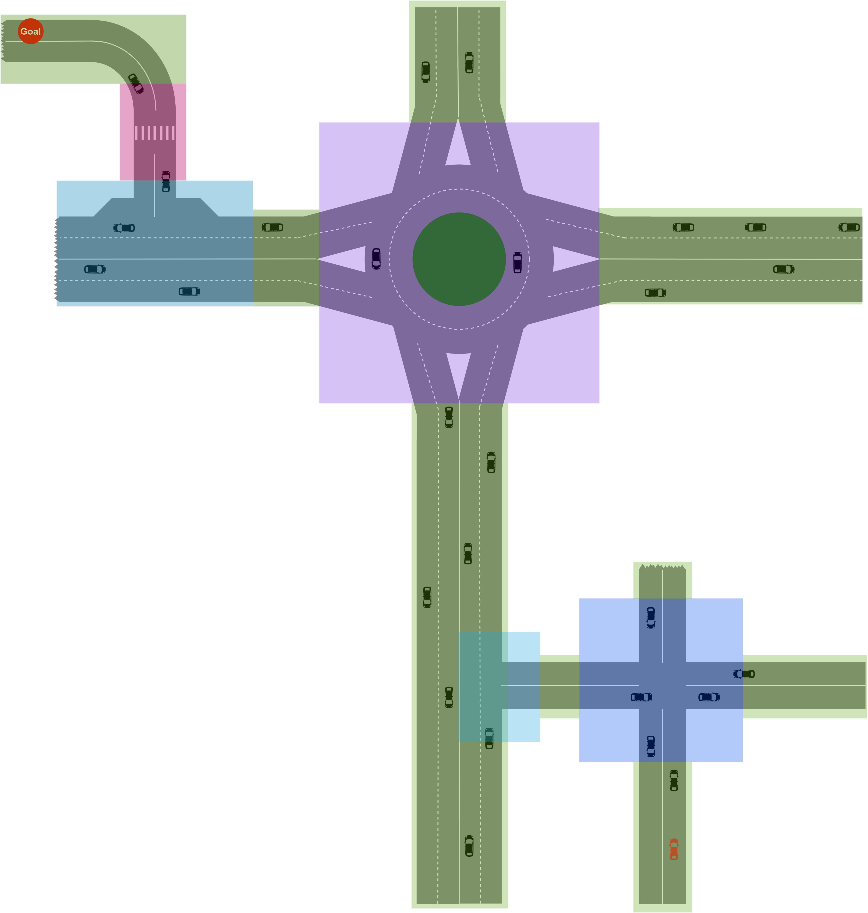
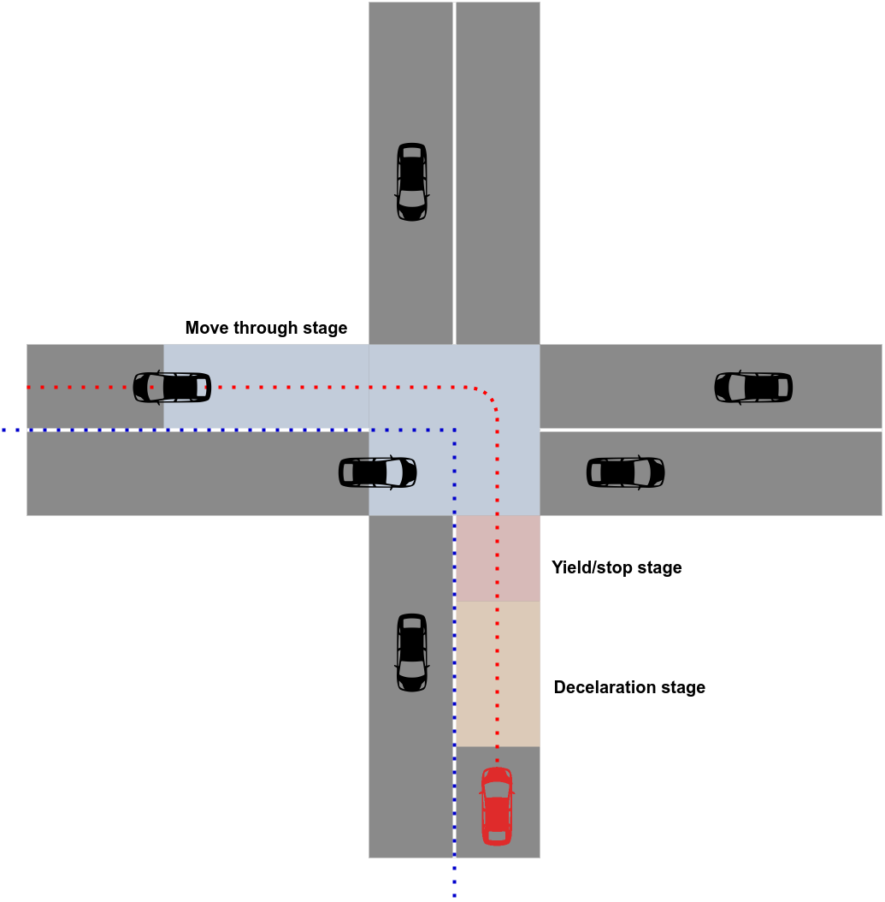
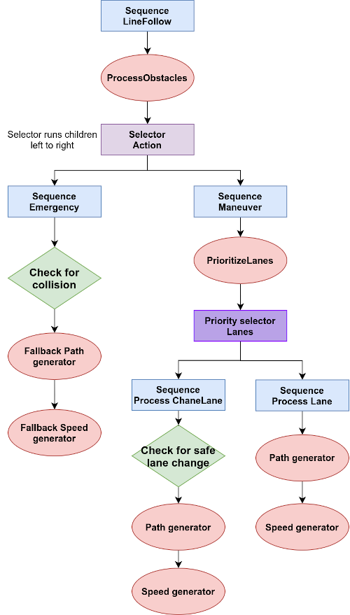
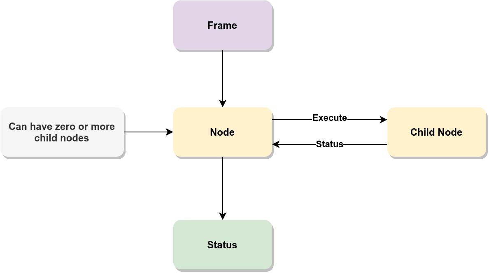
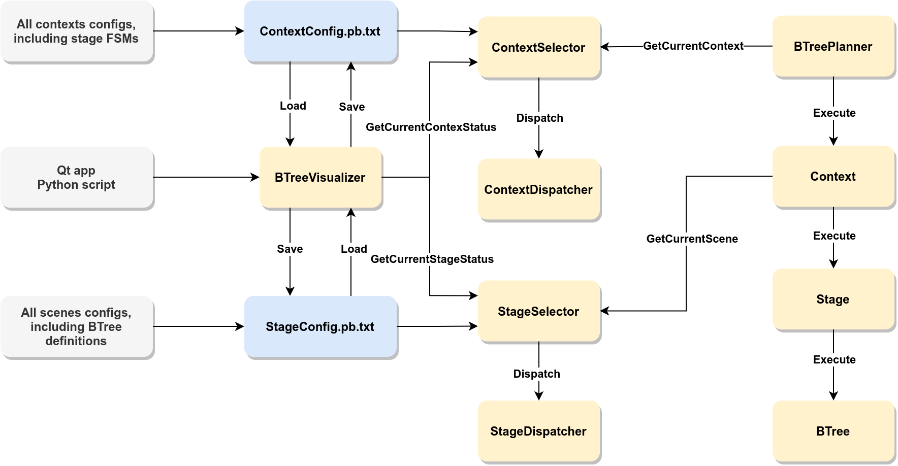

# Behaviour Planning

The goal of Behaviour Planning is to make local-level decisions. Hierarchical behaviour planning breaks the task into three parts:

## Context



Current situation we're in. For example: Lane Following, Intersection handling, etc

Imposes requirements and constraints. For example, enable traffic light detection module when in controlled intersection context and set new acceleration constraints

Next context can request the desired state for itself from the current context. For example, takeover context can request highway driving context to finish on the rightmost lane

Current context can be determined via map or perception

## Stage



Determines local goals. For example: decelerate to stop, wait until the path is clear

Narrows focus to reduced set of environmental features. For example, in deceleration stage the ego vehicle should not worry about cars on the intersection, it should worry about other cars when it is in the yield/stop stage

## Behaviour tree



Behaviour Trees implement stages. They have several features:

- Each node can have zero or more child nodes
- Each node takes `Frame` data structure for information sharing and outputs `State`
- We can enforce binary state result (`DONE` or `FAILED`) to guarantee a decision after every execution 
- We can enforce sequential execution process
- `Frame` should have consistent state after node has returned `State`
- If parent node needs something from child node(s), it is responsible for filling the `Frame` with all required data
- Every node is responsible for it's `Frame` part validation

Here is a high-level representation of how a behaviour tree node works: 




# Apollo implementation of the planner

## BTreePlanner



The proposed planner was implemented in Apollo as the `BTreePlanner` class

It is located in the `apollo/modules/planning/planner/btree` folder

In addition, it was necessary to modify several files:

### Plannig config proto

It is located in the `apollo/modules/planning/proto/planning_config.proto` file

Added `BTreePlanningConfig` protobuf messages

### PlannerDispatcher

It is located in the `apollo/modules/planning/planner/planner_dispatcher.cc` file

The `BTreePlanner` was added to the planner factory

### OnLanePlannerDispatcher

It is located in the `apollo/modules/planning/planner/on_lane_planner_dispatcher.cc` file

The main purpose of the modification was to add ability to dispatch the `BTreePlanner` when `btree_planning_config` is provided

### OnLanePlanning

It is located in the `apollo/modules/planning/on_lane_planning.cc` file

It was necessary to add the `BTreePlanner` into the `CheckPlanningConfig` function to initialize the planner, otherwise it returned error and crashed

## BTreePlanner configuration

The configuration is performed into three files:

- `apollo/modules/planning/conf/planning_config.pb.txt`
- `apollo/modules/planning/conf/b_tree_context_config.pb.txt`
- `apollo/modules/planning/conf/b_tree_stage_config.pb.txt`

### Planner configuration

In this file we inform Apollo about the planner we want to use. In order to use the `BTreePlanner`, we need to provide `btree_planning_config`, which consists of several fields:

- `planner_type` - name of the planner. It should always be `BTREE`
- `context_to_use` - types of contexts we want the planner to use
- `parameters` - some additional planner parameters

Let us consider an example of the planner configuration:

```
btree_planning_config
{
  planner_type: BTREE
  context_to_use: LANE_FOLLOW_CONTEXT  
}
```

This configuration will execute `BTreePlanner` with one context of type `LANE_FOLLOW_CONTEXT`

### Context configuration

This file describes all available contexts, their parameters and Finite State Machines (FSMs) for stage transitions.

FSM consists of three types of fields:

- `stage` - one or more stages our FSM has
- `transition` - one or more transitions the FSM has. We will describe the structure of the transition below
- `initial_stage` - type of the stage to be considered as the starting one

Now let's discuss transitions. Every transition has the following structure:

```
transition
{
	on_state: STAGE_STATE
	from_stage: STAGE_TYPE_1
	to_stage: STAGE_TYPE_2
}
```

This means that if we are in the `STAGE_TYPE_1` and it returned `STAGE_STATE` after the execution, FSM will transition to the `STAGE_TYPE_2`

For example:

```
{
	on_state: STAGE_DONE
	from_stage: LANE_FOLLOW_STAGE
	to_stage: LANE_FOLLOW_STAGE
}
```

This means that if the execution of the `LANE_FOLLOW_STAGE` returned `STAGE_DONE`, we will execute it again

### Stage configuration

This file describes all available stages along with their parameters and behaviour tree configurations.

Each stage configuration consists of the following fields:

- `type` - type of the stage
- `tree` - description of the behaviour tree of this stage
- `parameters` - parameters for this stage

Now we discuss the `tree` field. Each tree has the following structure:

```
tree
{
	root_node_id
	node
	{
		id
		name
		type
		child_id
		config
	}
}
```

So, each tree has it's root node, which is being executed when a stage is being executed, and a list of nodes that define the structure of the tree

Each node has:

- `id` - unique id of the node. Required since we can have multiple nodes of the same type, but with different configurations
- `name` - human-readable node name. Need not to be unique
- `type` - type of the node for the node dispatcher
- `child_id` - zero or more ids of child nodes of the current node. This is how nodes are being linked together
- `config` - configuration parameters for the node

For example:

```
tree
{
	root_node_id: "lane_follow_sequence"
	node
	{
	   id: "lane_follow_sequence"
	   name: "Lane Follow Sequence"
	   type: SEQUENCE
	   child_id: "obstacle_processor_task"
	   config
	   {
	      default_config
	      {
	      }
	   }
	}

	node
	{
	   id: "obstacle_processor_task"
	   name: "Obstacle Processor Task"
	   type: OBSTACLE_PROCESSOR_TASK
	   config
	   {
	      default_config
	      {
	      }
	   }
	}
}
```

Here we have defined a behaviour tree with two nodes. `lane_follow_sequence` node of type `SEQUENCE` has one child, which is the `obstacle_processor_task` node of type `OBSTACLE_PROCESSOR_TASK`. Both nodes have the default configuration file

The root node of the tree is the `lane_follow_sequence` node, so it will be executed first. Since it has the `SEQUENCE` type, the execution of the `lane_follow_sequence` node will trigger the execution of the `obstacle_processor_task` node  

## Adding your own contexts, stages and behaviour tree nodes

If you want to add your own features to the planner, check out these sections:

### Adding new context

- Create a new folder with the name of the context in `apollo/modules/planning/contexts`
- Add `context_name_context.h` and `context_name_context.cc` context implementation
- Create folder for stages `apollo/modules/planning/contexts/context_name/stages`
- Add new context type in the `b_tree_context_config.proto`
- Register new context into the `apollo/modules/planning/contexts/context_dispatcher.cc`
- Update context selection logic in the `GetCurrentContext()` function of the `apollo/modules/planning/contexts/context_selector.cc` 

### Adding new stage

- Create a new folder with the name of the stage within the selected context's `stages` folder
- Add `stage_name_stage.h` and `stage_name_stage.cc` stage implementation
- Add new stage type in the `b_tree_stage_config.proto`
- Register your stage in the `apollo/modules/planning/contexts/stage_dispatcher.cc`

### Adding new behaviour tree node

- Create a new folder for your node under `checks` or `tasks` in the `apollo/modules/planning/behaviour_tree` folder
- Implement your node `your_node.cc` and `your_node.h` files
- Add new node type in the `b_tree_config.proto`
- Add new node config in the `b_tree_node_config.proto` if needed, or use one of the existing configs
- Register your node in the `apollo/modules/planning/behaviour_tree/b_tree_node_dispatcher.cc`